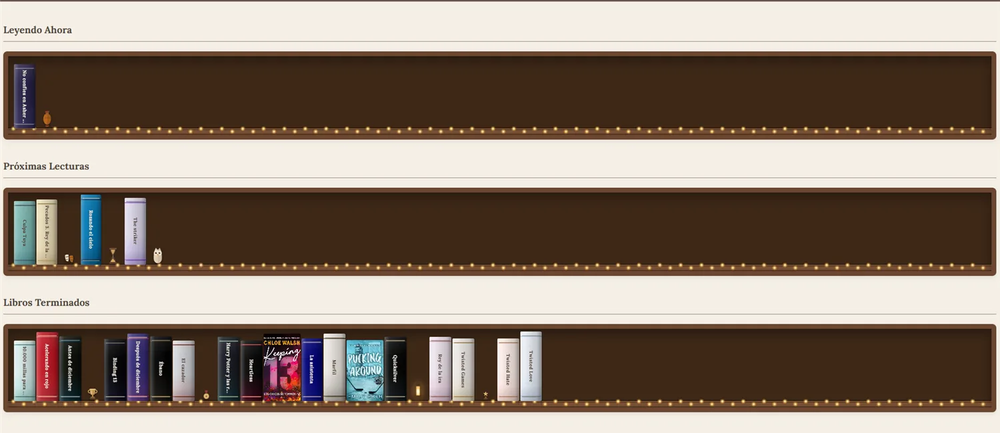
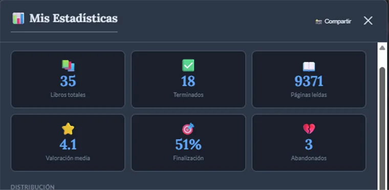
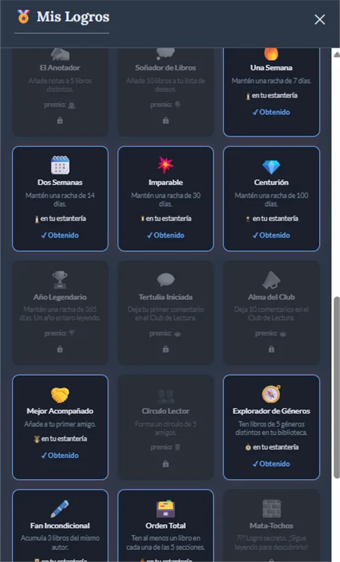

# Mi Rincón de Lectura


**Una app para convertir la lectura en hábito, en español, gratis y sin anuncios.**

Goodreads apenas ha cambiado en años, no está bien traducido y no ayuda a leer más: solo sirve para apuntar lo que ya has leído. Mi Rincón de Lectura es una alternativa pensada para crear el hábito:

- **Estantería visual** con tus libros por secciones (leyendo, próximas, terminados, abandonados)
- **Rachas** de lectura
- **Objetivos** diarios y semanales
- **Logros**
- **Estadísticas** de lo que lees y a qué ritmo
- **Parte social:** amigos, chat, club de lectura con comentarios sin spoilers y lecturas conjuntas

Está en producción con 72 usuarias activas (dato de Firebase Analytics).

<p align="center">
  
</p>

---

## Demo

🌐 **En vivo:** [**rinconlectura.es**](https://rinconlectura.es)

Te puedes registrar gratis. En la portada hay una biblioteca de demostración que se puede probar sin cuenta.

## Capturas

**La estantería.** Los lomos no vienen de ninguna API: se generan en el navegador a partir de la portada de cada libro.



| Estadísticas | Logros |
|---|---|
|  |  |

## Funcionalidades

- **Biblioteca** por secciones, con dos vistas: cuadrícula o estantería decorable con adornos desbloqueables.
- **Búsqueda de libros** en Google Books con OpenLibrary de respaldo. Importa desde Goodreads (CSV) y exporta a CSV.
- **Sesiones de lectura** con cronómetro y una predicción de cuándo terminarás el libro, calculada con tu ritmo real.
- **Rachas, objetivos y logros**, con notificaciones push si la racha está en riesgo o cumples un objetivo.
- **Estadísticas**: géneros, valoraciones, autores, ritmo narrativo y estados de ánimo, filtrables por género.
- **Social**:
  - amigos y chat
  - club de lectura: solo ves los comentarios hasta la página por la que vas
  - lecturas conjuntas con la barra de progreso de las dos
- **Recomendaciones explicadas**: cada sugerencia dice por qué te la hace, a partir de tus gustos y de lo que les encantó a tus amigos.
- **Compartir en redes**: genera una imagen de tu estantería o de tus estadísticas.
- **Papelera** de 30 días, **modo offline**, **modo oscuro** y **app Android** empaquetada con Capacitor.

## Tecnologías

| Capa | Tecnología |
|------|------------|
| Frontend | HTML, CSS y **JavaScript vanilla** (módulos ES), sin framework. Build con **Vite 8** y varias páginas de entrada |
| Backend | **Firebase**: Auth, Firestore (caché persistente offline), Hosting y **Cloud Functions v2** (Node 24, `europe-west1`) |
| Notificaciones | **Firebase Cloud Messaging** con service worker propio |
| Móvil | **Capacitor 8** (Android) |
| Gráficas / imágenes | **Chart.js 4** y **html2canvas**, ambas cargadas solo cuando se usan |
| APIs externas | Google Books y OpenLibrary |
| Tests | `node:test` (187 tests unitarios), **Firebase Emulator Suite** (reglas + Functions) y **Playwright** (e2e) |

## Instalación y ejecución en local

**Requisitos:** Node.js 24 y [Firebase CLI](https://firebase.google.com/docs/cli) (`npm i -g firebase-tools`).

```bash
git clone https://github.com/mestepa12/Rincon-de-lectura.git
cd Rincon-de-lectura
npm install
npm --prefix functions install
```

### Opción A: con emuladores (recomendada, no necesita credenciales)

```bash
npm run dev:emu       # emuladores de Firebase + Vite
npm run emu:semilla   # en otra terminal: crea cuentas de prueba con libros
```

Abre la URL que muestra Vite (normalmente `http://localhost:5173`) y entra con `ana@prueba.test` / `prueba1234`. Abajo a la izquierda aparece una etiqueta **EMULADORES** mientras no estés usando el backend real.

> `.env.emulador` está en el repositorio a propósito: solo contiene `VITE_USE_EMULATORS=true`, sin ninguna credencial. Así este modo funciona nada más clonar.

### Opción B: contra tu propio proyecto de Firebase

```bash
cp .env.example .env   # rellena con la config web de tu proyecto
npm run dev
```

### Otros comandos

```bash
npm test              # tests unitarios (node:test)
npm run test:emu      # tests de reglas y Cloud Functions contra los emuladores
npm run build         # build de producción en dist/
npm run android       # build + sincronizar y abrir el proyecto Android
npm run proyecto      # ¿contra qué proyecto de Firebase apunta cada comando?
```

Los cuatro entornos (emuladores, canal de preview, proyecto dev y producción) y cómo desplegar en cada uno están documentados en [ENTORNOS.md](ENTORNOS.md).

---

## Lo más destacado técnicamente

### Seguridad y privacidad

- **Reglas de Firestore con validación de esquema.** Solo se aceptan campos permitidos, con tipos y longitudes comprobados, y la validación se aplica solo a los campos que cambian (`affectedKeys`) para no bloquear documentos antiguos.
- **La pertenencia a un chat se comprueba sin lecturas extra.** El ID del chat son los dos uids ordenados, y las reglas lo verifican leyendo el propio ID.
- **Los datos privados se guardan aparte del perfil público.** Los correos no se guardan en Firestore (los tiene Firebase Auth) y los tokens de notificaciones van en un subdocumento que solo lee su dueña. Las reglas rechazan cualquier intento de volver a escribirlos en el perfil.
- **Protección contra despliegues por error.** `.firebaserc` no tiene proyecto por defecto, cada script pasa `--project` explícito y un `predeploy` (`guardia-produccion.mjs`) frena los despliegues a producción que no se han pedido.
- **El código de emuladores nunca llega a producción.** Se activa con tres condiciones a la vez, y la primera, `import.meta.env.DEV`, hace que Rollup lo elimine del build de producción.

### Rendimiento

- **Chunks con carga diferida.** Firebase Messaging (~91 kB), Chart.js y html2canvas se descargan solo cuando se usan.
- **La portada pública no carga el SDK de Firebase.** Solo comprueba si existe la base de IndexedDB donde Firebase guarda la sesión, y se ahorra ~260 kB y 6 peticiones si no la hay.
- **Plugins de Vite propios:**
  - URLs limpias
  - banner de cookies incrustado en el HTML y minificado en el build
  - un script de la portada que se carga cuando el navegador queda libre, lo que mejoró la puntuación de Lighthouse en las páginas de contenido
- **Caché en varios niveles para la búsqueda de libros:**
  - caché en memoria de las consultas
  - las dos fuentes (Google Books y OpenLibrary) se consultan en paralelo
  - los reintentos pasan por una **Cloud Function como proxy**, detrás del CDN de Hosting, porque Google limita por IP y las redes móviles comparten la misma IP entre miles de usuarios

### Detalles que marcan la diferencia

- **Lomos de libro generados en el navegador.** Se toma el color dominante de la portada (votando entre los píxeles del borde) en un `<canvas>`, se crea una textura y se guarda en caché como JPEG de unos 2 KB. Un hash determinista hace que cada libro se vea siempre igual.
- **Compatibilidad con iOS Safari:**
  - las capturas para compartir quitan temporalmente del DOM lo que no hace falta, para no pasarse del límite de memoria de canvas
  - si la hoja de compartir no llega a abrirse, se ofrece un botón para relanzarla con un toque nuevo
- **Club de lectura sin spoilers.** Solo ves los comentarios escritos hasta la página por la que vas.
- **Lógica de backend en Cloud Functions:**
  - avisos de racha en riesgo
  - reinicio nocturno de rachas caducadas
  - notificaciones de amistad, chat y lecturas conjuntas

### Tests

- **187 tests unitarios** con `node:test` sobre la lógica pura, que está sacada del DOM a módulos pequeños (fechas locales, sesiones de lectura, papelera, consentimiento, analítica, nombres de usuario…).
- **Tests contra Firebase Emulator Suite** que ejercitan las reglas de seguridad reales y las Cloud Functions: borrado de cuenta, tokens, comentarios, perfiles y registro.
- **Scripts e2e con Playwright** para bugs que ya ocurrieron en producción, como el doble envío del registro o una sesión de lectura que se queda sin libro.
